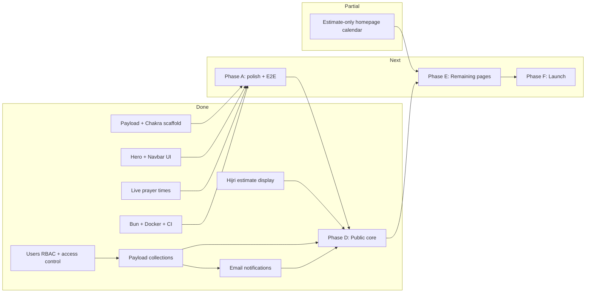

# Al-Furqan Institute — Next Phases

## Current state

| Area | Status |
| --- | --- |
| Payload + Next.js + Postgres adapter | Done ([`payload.config.ts`](src/app/(payload)/payload.config.ts)) |
| Chakra UI, brand theme, layout, navbar | Done ([`theme.ts`](src/components/theme.ts), [`Navbar.tsx`](src/components/nav/Navbar.tsx)) |
| Homepage hero — Hijri date | **Verdict-aware (Phase D)** — [`resolveHijriDateDisplay`](src/lib/hijri/resolve.ts) prefers the latest published Melbourne `sighted` verdict and flips `isEstimated` to `false` when one covers today; falls back to the `hijri-date` estimate otherwise ([`HeroBrand.tsx`](src/components/hero/HeroBrand.tsx)) |
| Homepage verdict banner | **Done (Phase D)** — most prominent element via [`VerdictBanner.tsx`](src/components/verdict/VerdictBanner.tsx): sighted / not-sighted / awaiting-verdict states, summary + published timestamp |
| Homepage hero — prayer times | **Live** via Al-Adhan API ([`prayerTimesController.ts`](src/lib/controllers/prayerTimesController.ts) → [`/api/prayer-times`](src/app/(frontend)/api/prayer-times/route.ts) → [`PrayerTimesPanel.tsx`](src/components/hero/PrayerTimesPanel.tsx)) |
| Homepage calendar section | **Partial / estimate-only** — [`CalendarSection.tsx`](src/components/calendar/CalendarSection.tsx) + [`MonthCalendar.tsx`](src/components/calendar/MonthCalendar.tsx) use [`calendar.ts`](src/lib/hijri/calendar.ts); embedded on `/`, not a `/calendar` route and not yet verdict-aware |
| Homepage live content | **Done (Phase D)** — next trip + recent announcements + subscribe CTA read from Payload via [`content.ts`](src/lib/content.ts) / [`payload.ts`](src/lib/payload.ts); shared footer + per-page SEO metadata |
| Dev tooling (Bun, Docker, env template) | Done — [`.env.example`](.env.example), [`docker-compose.yml`](docker-compose.yml), `bun.lock` (no `package-lock.json`), Chakra providers under [`src/components/ui/`](src/components/ui/) |
| GitHub Actions CI | Done ([`.github/workflows/ci.yml`](.github/workflows/ci.yml)) — lint, typecheck, unit + integration tests on Postgres; **E2E not in CI yet** |
| Hijri unit tests | **7 passing** ([`tests/unit/`](tests/unit/)) — `gregorianToHijriParts`, `getMelbourneGregorianDate` |
| Users RBAC | **Done** — `roles` select field (`admin` \| `editor`) with `saveToJWT` on [`Users.ts`](src/app/(payload)/collections/Users.ts); shared access helpers in [`access/`](src/app/(payload)/access/); first-user bootstrap via [`assignAdminToFirstUser`](src/app/(payload)/hooks/assignAdminToFirstUser.ts); [`Media`](src/app/(payload)/collections/Media.ts) gated to admins/editors |
| Build / typecheck | **Passing** — `bun run build` and `bun run typecheck` green |
| Integration tests | **6 passing** ([`api.int.spec.ts`](tests/int/api.int.spec.ts)) — users/RBAC, Verdict→HijriMonth hook, subscriber token generation, double opt-in confirmation |
| E2E tests | **Local only** — homepage title ([`frontend.e2e.spec.ts`](tests/e2e/frontend.e2e.spec.ts)) + admin panel navigation ([`admin.e2e.spec.ts`](tests/e2e/admin.e2e.spec.ts)); not wired into CI |
| Verdict-aware Hijri override | **Not started** — estimates only; confirmed months will come from Payload Verdicts (Phase B + D) |
| Domain collections | **Done (Phase B)** — `Verdicts`, `HijriMonths`, `SightingReports`, `Trips`, `Announcements`, `Subscribers` registered in [`payload.config.ts`](src/app/(payload)/payload.config.ts); access via shared helpers; Verdict→HijriMonth `afterChange` upsert wired |
| Email / Resend | **Done (Phase C)** — conditional `resendAdapter` in [`payload.config.ts`](src/app/(payload)/payload.config.ts) (console fallback when no key); React Email templates + send helpers in [`src/lib/email/`](src/lib/email/); double opt-in via `POST /api/subscribe` → `/confirm` → `/unsubscribe`; verdict blast to confirmed subscribers on first publish ([`notifySubscribersOnVerdict`](src/app/(payload)/hooks/notifySubscribersOnVerdict.ts)) |
| Public pages beyond `/` | **Partial** — `/subscribe` (Phase D), `/confirm`, `/unsubscribe`, and `POST /api/subscribe` exist; nav links to `/calendar`, `/trips`, `/reports`, `/about` still 404 (Phase E) |
| Deploy | **Not started** |

---

## Phase A — Finish foundation (complete original Phase 1)

**Goal:** Stable dev environment and shared utilities before CMS work.

### Done

**Hijri Step 1 — estimate fallback**

- **`hijri-date` library** integrated with TypeScript shim ([`src/types/hijri-date.d.ts`](src/types/hijri-date.d.ts)).
- **Melbourne-anchored conversion** — `getMelbourneGregorianDate()`, `gregorianToHijriParts()` in [`hijriDate.ts`](src/lib/controllers/hijriDate.ts); shared `HIJRI_MONTHS` in [`constants.ts`](src/lib/hijri/constants.ts).
- **Hero display wired** — `getFormattedHijriDate()` → `getHijriDateDisplay()` ([`src/lib/hijri/`](src/lib/hijri/)) shows live estimated Hijri + Gregorian labels with `isEstimated: true`.
- **Unit tests** — [`gregorianToHijriParts.spec.ts`](tests/unit/gregorianToHijriParts.spec.ts), [`getMelbourneGregorianDate.spec.ts`](tests/unit/getMelbourneGregorianDate.spec.ts); `bun run test:unit` passes (7 tests).
- **Month spellings aligned** — Payload `Verdicts` and Hijri helpers import the same [`HIJRI_MONTHS`](src/lib/hijri/constants.ts) values (`Rabi' I`, `Rabi' II`, etc.).
- **Estimate-only calendar building blocks** — [`calendar.ts`](src/lib/hijri/calendar.ts), [`CalendarSection.tsx`](src/components/calendar/CalendarSection.tsx), [`MonthCalendar.tsx`](src/components/calendar/MonthCalendar.tsx) render a Hijri/Gregorian month grid on the homepage.

**Prayer times**

- **Al-Adhan API** integrated for Melbourne ([`prayerTimesController.ts`](src/lib/controllers/prayerTimesController.ts)).
- **Client panel** fetches via [`/api/prayer-times`](src/app/(frontend)/api/prayer-times/route.ts) with loading/error states ([`PrayerTimesPanel.tsx`](src/components/hero/PrayerTimesPanel.tsx)).

**Tooling**

- [`.env.example`](.env.example): `DATABASE_URL`, `PAYLOAD_SECRET`, `RESEND_API_KEY`, `NEXT_PUBLIC_SERVER_URL`.
- [`docker-compose.yml`](docker-compose.yml): Postgres 16 + `oven/bun:1-alpine` dev service.
- [`package.json`](package.json): Bun-only engines; `test` runs unit + int + e2e; `typecheck` script added.
- Chakra providers consolidated under [`src/components/ui/`](src/components/ui/); stray `(frontend)/src/` tree removed.
- Vitest include glob: `tests/unit/**/*.spec.ts` and `tests/int/**/*.int.spec.ts`.
- **GitHub Actions CI** — lint, typecheck, build + unit tests, build + integration tests ([`.github/workflows/ci.yml`](.github/workflows/ci.yml)).

**Admin auth (RBAC)**

- **`roles` select field** on Users (`admin` \| `editor`, `hasMany`, `saveToJWT: true`, default `editor`) in [`Users.ts`](src/app/(payload)/collections/Users.ts).
- **Shared access helpers** — [`access/roles.ts`](src/app/(payload)/access/roles.ts) (`isAdmin`, `isAdminOrEditor`, `USER_ROLES`) and [`access/index.ts`](src/app/(payload)/access/index.ts) (`adminOnly`, `adminsOrSelf`, `allowFirstUserCreate`, etc.).
- **First-user bootstrap** — [`assignAdminToFirstUser`](src/app/(payload)/hooks/assignAdminToFirstUser.ts) hook assigns `admin` when `totalDocs === 0`; [`allowFirstUserCreate`](src/app/(payload)/access/index.ts) permits unauthenticated create only for the first user.
- **Role field access** — only admins can read/update the `roles` field on other users.
- **Media access** — admins and editors can create/update/delete; public read for uploads.
- **Types generated** — `User.roles` in [`payload-types.ts`](src/app/(payload)/payload-types.ts).
- **Integration test** — editor role persistence in [`api.int.spec.ts`](tests/int/api.int.spec.ts).
- **E2E admin tests** — login, dashboard, users list/create via [`admin.e2e.spec.ts`](tests/e2e/admin.e2e.spec.ts) with [`seedUser`](tests/helpers/seedUser.ts) helper.

### Remaining

- **Hijri polish**
  - Consolidate duplicate Melbourne date helpers in [`hijriDate.ts`](src/lib/controllers/hijriDate.ts) and [`calendar.ts`](src/lib/hijri/calendar.ts) (`getMelbourneGregorianDate` / `getMelbourneToday`).
  - Optionally move logic from `controllers/hijriDate.ts` → `src/lib/hijri/estimate.ts` + `format.ts`.
  - Add remaining unit tests: `getFormattedHijriDate` with fake timers, `getHijriDateDisplay` passthrough.
- **Tests**
  - Update E2E to assert live Hijri line on homepage (currently only checks page title in [`frontend.e2e.spec.ts`](tests/e2e/frontend.e2e.spec.ts)).
  - Add E2E job to CI (or document why it stays local-only until a stable test DB seed exists).
  - Keep integration test pattern in [`api.int.spec.ts`](tests/int/api.int.spec.ts).

**Exit criteria:** `bun run dev` + `bun run build` + `bun run typecheck` pass; `bun run test:unit` green; admin user with roles works; hero shows live estimated Hijri date; E2E asserts Hijri display and runs in CI.

---

## Phase B — Data model (original Phase 2) ✅ Done

**Goal:** Full CMS for non-technical staff; public read access for published content.

**Status:** All six collections implemented and registered; types generated; `bun run build` +
`bun run typecheck` green; integration tests cover the Verdict→HijriMonth hook and subscriber
token generation / confirmation (6 passing total). `read` is public for content and gated on `publishedAt` for
Verdicts/Announcements via [`publishedOrEditors`](src/app/(payload)/access/index.ts); Subscribers
are admin-read-only. Shared month list lives in [`constants.ts`](src/lib/hijri/constants.ts).

Collections live under [`src/app/(payload)/collections/`](src/app/(payload)/collections/), are registered in [`payload.config.ts`](src/app/(payload)/payload.config.ts), and generated types are checked in.

| Collection | Key fields | Notes |
| --- | --- | --- |
| **Verdicts** | hijriMonth, hijriYear, gregorianStartDate, status, region (default Melbourne), summary, publishedAt | Source of truth for month starts |
| **SightingReports** | date, region, observer, method, result, conditions, trip (rel) | Indonesia flagged as supporting evidence in admin labels |
| **Trips** | title, scheduledDate, sunset/moonset, location, attendees, status, outcome | |
| **HijriMonths** | name, year, confirmedStartDate, isConfirmed | Populated/updated via Verdict `afterChange` hook |
| **Announcements** | title, body, publishedAt | |
| **Subscribers** | email (unique), confirmedAt, unsubscribeToken | PII — admin read only |

**Access control pattern:**

- Published content: `read` public (filter `publishedAt` not null where applicable).
- `create` / `update` / `delete`: authenticated `admin` or `editor` — reuse helpers from [`access/`](src/app/(payload)/access/).
- Subscribers: no public read; public create only via dedicated API route (Phase C).

**Verdict hook:** `afterChange` on publish of a `sighted` Verdict upserts the matching `HijriMonth` with `isConfirmed: true`; Phase C email hook is wired separately on first publish.

**Shared constants:** `HIJRI_MONTHS` lives in [`constants.ts`](src/lib/hijri/constants.ts) and is reused by the Verdict `hijriMonth` select field and Hijri display helpers.

**Exit criteria:** ✅ Staff can log into `/admin`, create a Trip + SightingReport (Melbourne + Indonesia) + Verdict; `HijriMonth` reflects a published sighted verdict.

---

## Phase C — Email notifications (original Phase 3) ✅ Done

**Goal:** Double opt-in subscriptions and verdict blast on publish.

**Status:** Implemented and green (`bun run build` + `typecheck`; 6 integration tests, 7 unit
tests). `RESEND_API_KEY`-gated adapter so local dev/CI fall back to Payload's console transport.

- **Adapter** — `@payloadcms/email-resend` + `resend` + `@react-email/{components,render}` added.
  Conditional `resendAdapter` in [`payload.config.ts`](src/app/(payload)/payload.config.ts)
  (`defaultFromAddress` ← `EMAIL_FROM`, default `noreply@alfurqan.institute`); `email` left
  `undefined` when no key so `payload.sendEmail` logs instead of throwing.
- **`src/lib/email/`** — React Email templates [`ConfirmationEmail.tsx`](src/lib/email/templates/ConfirmationEmail.tsx)
  + [`VerdictEmail.tsx`](src/lib/email/templates/VerdictEmail.tsx) (with unsubscribe link);
  [`send.ts`](src/lib/email/send.ts) renders to HTML + dispatches via `payload.sendEmail`;
  [`urls.ts`](src/lib/email/urls.ts) / [`format.ts`](src/lib/email/format.ts) helpers (Melbourne dates).
- **Subscriber tokens** — added `confirmToken` (separate from `unsubscribeToken`);
  [`ensureSubscriberTokens`](src/app/(payload)/hooks/ensureSubscriberTokens.ts) generates both on create.
- **Public routes / pages:**
  - `POST /api/subscribe` ([route](src/app/(frontend)/api/subscribe/route.ts)) — create/reuse a
    pending subscriber via Local API + send confirmation; generic response (no enumeration).
  - `/confirm?token=…` ([page](src/app/(frontend)/confirm/page.tsx)) — sets `confirmedAt`; styled Chakra result.
  - `/unsubscribe?token=…` ([page](src/app/(frontend)/unsubscribe/page.tsx)) — **deletes** the record (per decision); styled result.
- **Verdict blast** — [`notifySubscribersOnVerdict`](src/app/(payload)/hooks/notifySubscribersOnVerdict.ts)
  `afterChange` hook fires only on the publish transition (empty → set `publishedAt`), for both
  sighted and not-sighted verdicts; emails **confirmed-only** subscribers (`confirmedAt` exists),
  paginated, with per-recipient unsubscribe links and per-recipient error isolation.

**Exit criteria:** ✅ Flow runs locally (console transport without a key); publishing a verdict emails confirmed subscribers only. Remaining for Phase F: real `RESEND_API_KEY` + SPF/DKIM on the institute domain.

**Known gap:** No automated test currently asserts the verdict blast email path end-to-end.

---

## Phase D — Public site core (homepage + data layer) ✅ Done

**Goal:** Deliver the "is tomorrow Eid?" moment — the highest-priority requirement from [AGENTS.md](AGENTS.md).

**Status:** Implemented and green (`bun run build` + `typecheck` + `lint`; 7 unit tests). Homepage
is `force-dynamic` and reads live Payload data; `/subscribe` prerenders as a static page.

- **[`src/lib/payload.ts`](src/lib/payload.ts)** — cached `getPayloadClient()` helper for server
  components / route handlers; `/api/subscribe`, `/confirm`, `/unsubscribe` refactored onto it.
- **[`src/lib/hijri/resolve.ts`](src/lib/hijri/resolve.ts)** — verdict-aware resolver: latest
  published Melbourne `sighted` verdict with `gregorianStartDate <= today`; computes the Hijri day
  from the verdict start (UTC day diff, DST-safe) and sets `isEstimated: false` while today is
  within the month (day 1–30); falls back to the estimate otherwise.
- **[`src/lib/dates.ts`](src/lib/dates.ts)** — shared Melbourne date/time/time-only formatting +
  `formatRegionDateTime` (Indonesian times labelled WIB); [`email/format.ts`](src/lib/email/format.ts)
  now re-exports `formatMelbourneDate` from here.
- **[`src/lib/content.ts`](src/lib/content.ts)** — `getLatestVerdict`, `getNextTrip`,
  `getRecentAnnouncements`; [`richText.ts`](src/lib/richText.ts) extracts plain-text announcement excerpts.
- **Homepage [`page.tsx`](src/app/(frontend)/page.tsx):**
  1. **[`VerdictBanner`](src/components/verdict/VerdictBanner.tsx)** — most prominent element (sighted /
     not-sighted / awaiting-verdict), summary + published timestamp.
  2. Hero Hijri line now flips estimate → confirmed via the resolver.
  3. **[`UpcomingTrip`](src/components/home/UpcomingTrip.tsx)** + **[`RecentAnnouncements`](src/components/home/RecentAnnouncements.tsx)** — info cards (no dead links to Phase E routes; hidden when empty).
  4. **[`SubscribeCta`](src/components/home/SubscribeCta.tsx)** linking to `/subscribe`.
- **[`/subscribe`](src/app/(frontend)/subscribe/page.tsx)** — client [`SubscribeForm`](src/components/subscribe/SubscribeForm.tsx) posting to `POST /api/subscribe`, with idle/submitting/success/error states.
- **Shared layout** — [`Footer`](src/components/layout/Footer.tsx) in [`layout.tsx`](src/app/(frontend)/layout.tsx); per-page SEO metadata on `/` and `/subscribe`; banner clears the fixed navbar.

**Exit criteria:** ✅ Homepage reads live data from Payload; Hijri line flips from estimated to
confirmed when a sighted verdict covers today; verdict banner leads the page; subscribe flow works.

**Decisions made during build:** before any verdict exists, the banner shows an "awaiting verdict"
state using the estimate (start-fresh launch); trip/announcement sections are non-clickable until
their Phase E routes exist. ISR/caching is deferred to Phase F (homepage is `force-dynamic` for now).

---

## Phase E — Remaining public pages (original Phase 4)

Build server-component pages fetching via Local API; reuse shared card/list patterns.

| Route | Content |
| --- | --- |
| `/calendar` | Month grid; confirmed vs estimated months visually distinct; key Islamic dates (Ramadan, Eids, Ashura, Arafah) |
| `/trips` | Upcoming + past archive with outcomes and linked reports |
| `/reports` | Sighting report list; Indonesian entries labeled "supporting evidence" |
| `/verdicts` | Chronological verdict archive (not in nav yet — add to [`nav-config.ts`](src/components/nav/nav-config.ts) when built) |
| `/about` | Methodology (local sighting, Indonesia role, naked-eye vs aided), contact |

**Exit criteria:** All nav links in [`nav-config.ts`](src/components/nav/nav-config.ts) plus `/subscribe` and `/verdicts` resolve; mobile layouts verified; WCAG AA basics (contrast already on-brand, focus states, semantic headings).

**Current partial work:** Calendar UI exists on the homepage only; it is estimate-based and still needs a standalone `/calendar` route, Payload-backed confirmed month data, and key Islamic date markers.

---

## Phase F — Launch and hardening (original Phase 5)

**Goal:** Production-ready, spike-tolerant site.

- **Caching:** ISR / `revalidate` on public pages (verdict banner can use short revalidate or on-demand revalidation when verdict publishes).
- **Deploy:** Vercel + managed Postgres (Neon/Supabase); env vars; Payload migrations (`push: false` in prod).
- **Resend:** SPF/DKIM on institute domain.
- **SEO:** Per-page metadata, Open Graph, indexable verdict/calendar URLs for queries like "is it Eid tomorrow Melbourne".
- **E2E smoke tests:** Admin publish verdict → homepage updates; subscribe + confirm + blast.
- **Start fresh:** no historical seeding (per your decision); staff enter data from launch.

**Exit criteria:** Production smoke test passes; spike-ready static/ISR pages; email deliverability verified; CI green on all jobs including E2E.

---

## Deferred (post-launch)

- **Historical data import** — only if institute later requests backfill.
- **Open points from requirements:** subscriber volume/budget, custom domain, branding refinements beyond current logo/colors.

---

## Suggested execution order

Work in phase order **finish A → E → F**. Phases **B**, **C**, and **D** are implemented; the public
homepage now reads real Payload Verdicts, Trips, and Announcements.

**Next concrete tasks:** Hijri helper consolidation + E2E Hijri/verdict-banner assertions + CI E2E job → Phase E public routes (`/calendar` reusing the existing calendar components + Payload-confirmed months, then `/trips`, `/reports`, `/verdicts`, `/about`) → Phase F deploy, ISR/caching, Resend DNS, smoke tests.
