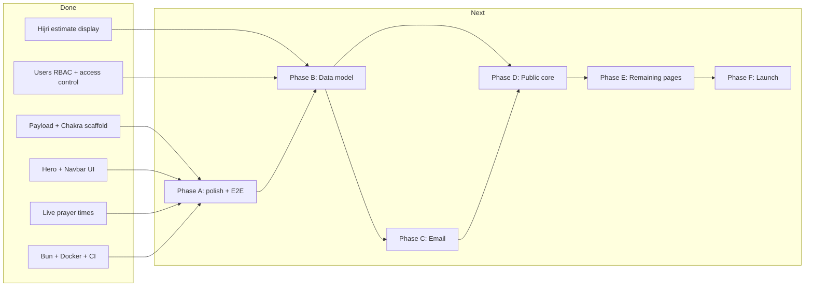

# Al-Furqan Institute — Next Phases

## Current state

| Area | Status |
| --- | --- |
| Payload + Next.js + Postgres adapter | Done ([`payload.config.ts`](src/app/(payload)/payload.config.ts)) |
| Chakra UI, brand theme, layout, navbar | Done ([`theme.ts`](src/components/theme.ts), [`Navbar.tsx`](src/components/nav/Navbar.tsx)) |
| Homepage hero — Hijri date | **Live estimates** via `hijri-date`, Melbourne timezone ([`hijriDate.ts`](src/lib/controllers/hijriDate.ts) → [`hijri.ts`](src/lib/hijri/hijri.ts) → [`HeroBrand.tsx`](src/components/hero/HeroBrand.tsx)); shows "Estimated · month start pending verdict" |
| Homepage hero — prayer times | **Live** via Al-Adhan API ([`prayerTimesController.ts`](src/lib/controllers/prayerTimesController.ts) → [`/api/prayer-times`](src/app/(frontend)/api/prayer-times/route.ts) → [`PrayerTimesPanel.tsx`](src/components/hero/PrayerTimesPanel.tsx)) |
| Dev tooling (Bun, Docker, env template) | Done — [`.env.example`](.env.example), [`docker-compose.yml`](docker-compose.yml), `bun.lock` (no `package-lock.json`), Chakra providers under [`src/components/ui/`](src/components/ui/) |
| GitHub Actions CI | Done ([`.github/workflows/ci.yml`](.github/workflows/ci.yml)) — lint, typecheck, unit + integration tests on Postgres; **E2E not in CI yet** |
| Hijri unit tests | **7 passing** ([`tests/unit/`](tests/unit/)) — `gregorianToHijriParts`, `getMelbourneGregorianDate` |
| Users RBAC | **Done** — `roles` select field (`admin` \| `editor`) with `saveToJWT` on [`Users.ts`](src/app/(payload)/collections/Users.ts); shared access helpers in [`access/`](src/app/(payload)/access/); first-user bootstrap via [`assignAdminToFirstUser`](src/app/(payload)/hooks/assignAdminToFirstUser.ts); [`Media`](src/app/(payload)/collections/Media.ts) gated to admins/editors |
| Build / typecheck | **Passing** — `bun run build` and `bun run typecheck` green |
| Integration tests | **2 passing** ([`api.int.spec.ts`](tests/int/api.int.spec.ts)) — user fetch + editor role persistence |
| E2E tests | **Local only** — homepage title ([`frontend.e2e.spec.ts`](tests/e2e/frontend.e2e.spec.ts)) + admin panel navigation ([`admin.e2e.spec.ts`](tests/e2e/admin.e2e.spec.ts)); not wired into CI |
| Verdict-aware Hijri override | **Not started** — estimates only; confirmed months will come from Payload Verdicts (Phase B + D) |
| Domain collections | **Done (Phase B)** — `Verdicts`, `HijriMonths`, `SightingReports`, `Trips`, `Announcements`, `Subscribers` registered in [`payload.config.ts`](src/app/(payload)/payload.config.ts); access via shared helpers; Verdict→HijriMonth `afterChange` upsert wired |
| Email / Resend | **Not started** — `RESEND_API_KEY` in `.env.example` only; no adapter or routes |
| Public pages beyond `/` | **Not started** — nav links to `/calendar`, `/trips`, `/reports`, `/about`, `/subscribe` all 404 |
| Deploy | **Not started** |

---

## Phase A — Finish foundation (complete original Phase 1)

**Goal:** Stable dev environment and shared utilities before CMS work.

### Done

**Hijri Step 1 — estimate fallback**

- **`hijri-date` library** integrated with TypeScript shim ([`src/types/hijri-date.d.ts`](src/types/hijri-date.d.ts)).
- **Melbourne-anchored conversion** — `getMelbourneGregorianDate()`, `gregorianToHijriParts()`, exported `HIJRI_MONTHS` in [`hijriDate.ts`](src/lib/controllers/hijriDate.ts).
- **Hero display wired** — `getFormattedHijriDate()` → `getHijriDateDisplay()` ([`src/lib/hijri/`](src/lib/hijri/)) shows live estimated Hijri + Gregorian labels with `isEstimated: true`.
- **Unit tests** — [`gregorianToHijriParts.spec.ts`](tests/unit/gregorianToHijriParts.spec.ts), [`getMelbourneGregorianDate.spec.ts`](tests/unit/getMelbourneGregorianDate.spec.ts); `bun run test:unit` passes (7 tests).

**Prayer times**

- **Al-Adhan API** integrated for Melbourne ([`prayerTimesController.ts`](src/lib/controllers/prayerTimesController.ts)).
- **Client panel** fetches via [`/api/prayer-times`](src/app/(frontend)/api/prayer-times/route.ts) with loading/error states ([`PrayerTimesPanel.tsx`](src/components/hero/PrayerTimesPanel.tsx)).

**Tooling**

- [`.env.example`](.env.example): `DATABASE_URL`, `PAYLOAD_SECRET`, `RESEND_API_KEY`, `NEXT_PUBLIC_SERVER_URL`.
- [`docker-compose.yml`](docker-compose.yml): Postgres 16 + `oven/bun:1-alpine` dev service.
- [`package.json`](package.json): Bun-only engines; `test` runs unit + int + e2e; `typecheck` script added.
- Chakra providers consolidated under [`src/components/ui/`](src/components/ui/); stray `(frontend)/src/` tree removed.
- Vitest include glob: `tests/unit/**/*.spec.ts` and `tests/int/**/*.int.spec.ts`.
- **GitHub Actions CI** — lint, typecheck, build + unit tests, build + integration tests ([`.github/workflows/ci.yml`](.github/workflows/ci.yml)).

**Admin auth (RBAC)**

- **`roles` select field** on Users (`admin` \| `editor`, `hasMany`, `saveToJWT: true`, default `editor`) in [`Users.ts`](src/app/(payload)/collections/Users.ts).
- **Shared access helpers** — [`access/roles.ts`](src/app/(payload)/access/roles.ts) (`isAdmin`, `isAdminOrEditor`, `USER_ROLES`) and [`access/index.ts`](src/app/(payload)/access/index.ts) (`adminOnly`, `adminsOrSelf`, `allowFirstUserCreate`, etc.).
- **First-user bootstrap** — [`assignAdminToFirstUser`](src/app/(payload)/hooks/assignAdminToFirstUser.ts) hook assigns `admin` when `totalDocs === 0`; [`allowFirstUserCreate`](src/app/(payload)/access/index.ts) permits unauthenticated create only for the first user.
- **Role field access** — only admins can read/update the `roles` field on other users.
- **Media access** — admins and editors can create/update/delete; public read for uploads.
- **Types generated** — `User.roles` in [`payload-types.ts`](src/app/(payload)/payload-types.ts).
- **Integration test** — editor role persistence in [`api.int.spec.ts`](tests/int/api.int.spec.ts).
- **E2E admin tests** — login, dashboard, users list/create via [`admin.e2e.spec.ts`](tests/e2e/admin.e2e.spec.ts) with [`seedUser`](tests/helpers/seedUser.ts) helper.

### Remaining

- **Hijri polish**
  - Consolidate duplicate `getMelbourneToday` / `getMelbourneGregorianDate` helpers in `hijriDate.ts` (same logic, two implementations).
  - Optionally move logic from `controllers/hijriDate.ts` → `src/lib/hijri/estimate.ts` + `format.ts`; align month spellings with future Payload Verdict select (`Rabi' I` vs `Rabi'I`).
  - Add remaining unit tests: `getFormattedHijriDate` with fake timers, `getHijriDateDisplay` passthrough.
- **Tests**
  - Update E2E to assert live Hijri line on homepage (currently only checks page title in [`frontend.e2e.spec.ts`](tests/e2e/frontend.e2e.spec.ts)).
  - Add E2E job to CI (or document why it stays local-only until a stable test DB seed exists).
  - Keep integration test pattern in [`api.int.spec.ts`](tests/int/api.int.spec.ts).

**Exit criteria:** `bun run dev` + `bun run build` + `bun run typecheck` pass; `bun run test:unit` green; admin user with roles works; hero shows live estimated Hijri date; E2E asserts Hijri display and runs in CI.

---

## Phase B — Data model (original Phase 2) ✅ Done

**Goal:** Full CMS for non-technical staff; public read access for published content.

**Status:** All six collections implemented and registered; types generated; `bun run build` +
`bun run typecheck` green; integration tests cover the Verdict→HijriMonth hook and subscriber
token generation (5 passing). `read` is public for content and gated on `publishedAt` for
Verdicts/Announcements via [`publishedOrEditors`](src/app/(payload)/access/index.ts); Subscribers
are admin-read-only. Shared month list lives in [`constants.ts`](src/lib/hijri/constants.ts).

Add collections under [`src/app/(payload)/collections/`](src/app/(payload)/collections/), register in [`payload.config.ts`](src/app/(payload)/payload.config.ts), run `bun run generate:types`.

| Collection | Key fields | Notes |
| --- | --- | --- |
| **Verdicts** | hijriMonth, hijriYear, gregorianStartDate, status, region (default Melbourne), summary, publishedAt | Source of truth for month starts |
| **SightingReports** | date, region, observer, method, result, conditions, trip (rel) | Indonesia flagged as supporting evidence in admin labels |
| **Trips** | title, scheduledDate, sunset/moonset, location, attendees, status, outcome | |
| **HijriMonths** | name, year, confirmedStartDate, isConfirmed | Populated/updated via Verdict `afterChange` hook |
| **Announcements** | title, body, publishedAt | |
| **Subscribers** | email (unique), confirmedAt, unsubscribeToken | PII — admin read only |

**Access control pattern:**

- Published content: `read` public (filter `publishedAt` not null where applicable).
- `create` / `update` / `delete`: authenticated `admin` or `editor` — reuse helpers from [`access/`](src/app/(payload)/access/).
- Subscribers: no public read; public create only via dedicated API route (Phase C).

**Verdict hook (stub):** `afterChange` on first publish → upsert matching `HijriMonth` with `isConfirmed: true`; call email sender when Phase C is wired.

**Shared constants:** Reuse exported `HIJRI_MONTHS` from [`hijriDate.ts`](src/lib/controllers/hijriDate.ts) (or `src/lib/hijri/constants.ts`) for the Verdict `hijriMonth` select field.

**Exit criteria:** Staff can log into `/admin`, create a Trip + SightingReport (Melbourne + Indonesia) + Verdict; `HijriMonth` reflects the verdict.

---

## Phase C — Email notifications (original Phase 3)

**Goal:** Double opt-in subscriptions and verdict blast on publish.

- Add `@payloadcms/email-resend` + `resend` to dependencies; configure adapter in `payload.config.ts`.
- **`src/lib/email/`** — React Email templates: confirmation, verdict notification (with unsubscribe link).
- **Public routes:**
  - `POST /api/subscribe` — create pending subscriber, send confirmation.
  - `GET /confirm?token=…` — set `confirmedAt`.
  - `GET /unsubscribe?token=…` — remove/deactivate subscriber.
- **Verdict blast:** complete the `afterChange` hook — query `confirmedAt != null` subscribers, send via Resend.

**Exit criteria:** Test email flow end-to-end locally; publishing a verdict emails confirmed subscribers only.

---

## Phase D — Public site core (homepage + data layer)

**Goal:** Deliver the "is tomorrow Eid?" moment — the highest-priority requirement from [AGENTS.md](AGENTS.md).

- **`src/lib/payload.ts`** — `getPayload()` helper for server components (Payload Local API).
- **`src/lib/hijri/resolve.ts`** — verdict-aware resolver: query latest published Melbourne `sighted` Verdict; override estimate month/year/day; set `isEstimated: false` when a covering verdict exists.
- **`src/lib/dates.ts`** — Melbourne timezone formatting; Indonesian report times labeled with their zone.
- **Homepage [`page.tsx`](src/app/(frontend)/page.tsx)** — extend beyond hero:
  1. **Latest verdict banner** — most prominent element: *Sighted / Not sighted → month begins [date]*, timestamped.
  2. Next upcoming trip (if any).
  3. Recent announcements.
  4. Email signup CTA (links to `/subscribe` — navbar already points here).
- **`/subscribe`** — signup form + success/pending states.
- **Shared layout** — footer, page-level SEO metadata, mobile-first spacing under fixed navbar.

**Exit criteria:** Homepage reads live data from Payload; Hijri line flips from estimated to confirmed when a verdict is published; verdict banner is unambiguous on a phone at night; subscribe flow works.

---

## Phase E — Remaining public pages (original Phase 4)

Build server-component pages fetching via Local API; reuse shared card/list patterns.

| Route | Content |
| --- | --- |
| `/calendar` | Month grid; confirmed vs estimated months visually distinct; key Islamic dates (Ramadan, Eids, Ashura, Arafah) |
| `/trips` | Upcoming + past archive with outcomes and linked reports |
| `/reports` | Sighting report list; Indonesian entries labeled "supporting evidence" |
| `/verdicts` | Chronological verdict archive (not in nav yet — add to [`nav-config.ts`](src/components/nav/nav-config.ts) when built) |
| `/about` | Methodology (local sighting, Indonesia role, naked-eye vs aided), contact |

**Exit criteria:** All nav links in [`nav-config.ts`](src/components/nav/nav-config.ts) plus `/subscribe` and `/verdicts` resolve; mobile layouts verified; WCAG AA basics (contrast already on-brand, focus states, semantic headings).

---

## Phase F — Launch and hardening (original Phase 5)

**Goal:** Production-ready, spike-tolerant site.

- **Caching:** ISR / `revalidate` on public pages (verdict banner can use short revalidate or on-demand revalidation when verdict publishes).
- **Deploy:** Vercel + managed Postgres (Neon/Supabase); env vars; Payload migrations (`push: false` in prod).
- **Resend:** SPF/DKIM on institute domain.
- **SEO:** Per-page metadata, Open Graph, indexable verdict/calendar URLs for queries like "is it Eid tomorrow Melbourne".
- **E2E smoke tests:** Admin publish verdict → homepage updates; subscribe + confirm + blast.
- **Start fresh:** no historical seeding (per your decision); staff enter data from launch.

**Exit criteria:** Production smoke test passes; spike-ready static/ISR pages; email deliverability verified; CI green on all jobs including E2E.

---

## Deferred (post-launch)

- **Historical data import** — only if institute later requests backfill.
- **Open points from requirements:** subscriber volume/budget, custom domain, branding refinements beyond current logo/colors.

---

## Suggested execution order

Work strictly in phase order **A → B → C → D → E → F**. Phase C and D can overlap slightly once B is done (verdict hook stub in B, email wiring in C, frontend in D), but **do not ship the public verdict banner before B** — it must read real verdicts, not placeholders.

**Next concrete tasks:** Hijri helper consolidation + E2E Hijri assertion + CI E2E job → Phase B Verdicts collection with shared `HIJRI_MONTHS` → Phase D verdict override resolver on top of the existing estimate layer.
