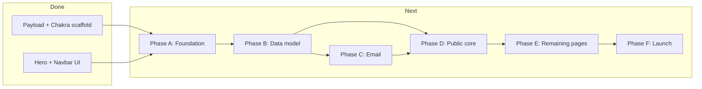

# Al-Furqan Institute — Next Phases

## Current state

| Area                                   | Status                                                                                                       |
| -------------------------------------- | ------------------------------------------------------------------------------------------------------------ |
| Payload + Next.js + Postgres adapter   | Done (`[payload.config.ts](src/app/(payload)`/payload.config.ts))                                            |
| Chakra UI, brand theme, layout, navbar | Done (`[theme.ts](src/components/theme.ts)`, `[Navbar.tsx](src/components/nav/Navbar.tsx)`)                  |
| Homepage hero (Hijri + prayer times)   | UI done; **placeholder data** (`[hijri.ts](src/lib/hijri.ts)`, `[prayer-times.ts](src/lib/prayer-times.ts)`) |
| Domain collections                     | **Not started** — only `Users` + `Media`                                                                     |
| Email / Resend                         | **Not started**                                                                                              |
| Public pages beyond `/`                | **Not started** (nav links 404)                                                                              |
| Deploy                                 | **Not started**                                                                                              |

Structural debt to clear early: outdated `[.env.example](.env.example)` (still MongoDB), [docker-compose.yml](docker-compose.yml) (Mongo + pnpm), duplicate UI provider paths (`src/components/ui/` vs `src/app/(frontend)/src/components/ui/`), stale E2E tests (`[frontend.e2e.spec.ts](tests/e2e/frontend.e2e.spec.ts)`), `package.json` test script still calls `pnpm`.

---

## Phase A — Finish foundation (complete original Phase 1)

**Goal:** Stable dev environment and shared utilities before CMS work.

- **Tooling cleanup**
  - Update `[.env.example](.env.example)`: `DATABASE_URL` (Postgres), `PAYLOAD_SECRET`, `RESEND_API_KEY`, `NEXT_PUBLIC_SERVER_URL`.
  - Switch [docker-compose.yml](docker-compose.yml) to Postgres + `bun` (or document Neon-only local dev and drop compose).
  - Normalize on Bun in `[package.json](package.json)` scripts (`bun run test:int` etc.).
  - Consolidate Chakra providers into one location under `src/components/ui/`; remove the stray `src/app/(frontend)/src/` tree.
- **Admin auth (RBAC)**
  - Extend `[Users.ts](src/app/(payload)`/collections/Users.ts) with `roles` (`admin` | `editor`), `saveToJWT: true`, admin-only role updates (per [docs/IMPLEMENTATION_PLAN.md](docs/IMPLEMENTATION_PLAN.md)).
- **Hijri display library (estimates only)**
  - Replace placeholder in `[hijri.ts](src/lib/hijri.ts)` with a vetted library (e.g. `@tabby_ai/hijri-converter` or `hijri-date`).
  - All output in `Australia/Melbourne`; mark estimates when no confirmed verdict covers the current month.
  - **Domain rule:** estimates are display-only; confirmed months always come from admin verdicts.
- **Tests**
  - Update E2E to assert current homepage (`Al Furqan Institute`, Hijri line).
  - Keep integration test pattern in `[api.int.spec.ts](tests/int/api.int.spec.ts)`.

**Exit criteria:** `bun run dev` + `bun run build` pass; admin user with roles works; hero shows live estimated Hijri date.

---

## Phase B — Data model (original Phase 2)

**Goal:** Full CMS for non-technical staff; public read access for published content.

Add collections under `[src/app/(payload)/collections/](src/app/(payload)`/collections/), register in `[payload.config.ts](src/app/(payload)`/payload.config.ts), run `bun run generate:types`.

| Collection          | Key fields                                                                                          | Notes                                                    |
| ------------------- | --------------------------------------------------------------------------------------------------- | -------------------------------------------------------- |
| **Verdicts**        | hijriMonth, hijriYear, gregorianStartDate, status, region (default Melbourne), summary, publishedAt | Source of truth for month starts                         |
| **SightingReports** | date, region, observer, method, result, conditions, trip (rel)                                      | Indonesia flagged as supporting evidence in admin labels |
| **Trips**           | title, scheduledDate, sunset/moonset, location, attendees, status, outcome                          |                                                          |
| **HijriMonths**     | name, year, confirmedStartDate, isConfirmed                                                         | Populated/updated via Verdict `afterChange` hook         |
| **Announcements**   | title, body, publishedAt                                                                            |                                                          |
| **Subscribers**     | email (unique), confirmedAt, unsubscribeToken                                                       | PII — admin read only                                    |

**Access control pattern:**

- Published content: `read` public (filter `publishedAt` not null where applicable).
- `create` / `update` / `delete`: authenticated `admin` or `editor`.
- Subscribers: no public read; public create only via dedicated API route (Phase C).

**Verdict hook (stub):** `afterChange` on first publish → upsert matching `HijriMonth` with `isConfirmed: true`; call email sender when Phase C is wired.

**Exit criteria:** Staff can log into `/admin`, create a Trip + SightingReport (Melbourne + Indonesia) + Verdict; `HijriMonth` reflects the verdict.

---

## Phase C — Email notifications (original Phase 3)

**Goal:** Double opt-in subscriptions and verdict blast on publish.

- Add `@payloadcms/email-resend` + `resend` to dependencies; configure adapter in `payload.config.ts`.
- `**src/lib/email/`** — React Email templates: confirmation, verdict notification (with unsubscribe link).
- **Public routes:**
  - `POST /api/subscribe` — create pending subscriber, send confirmation.
  - `GET /confirm?token=…` — set `confirmedAt`.
  - `GET /unsubscribe?token=…` — remove/deactivate subscriber.
- **Verdict blast:** complete the `afterChange` hook — query `confirmedAt != null` subscribers, send via Resend.

**Exit criteria:** Test email flow end-to-end locally; publishing a verdict emails confirmed subscribers only.

---

## Phase D — Public site core (homepage + data layer)

**Goal:** Deliver the "is tomorrow Eid?" moment — the highest-priority requirement from [AGENTS.md](AGENTS.md).

- `**src/lib/payload.ts`** — `getPayload()` helper for server components (Payload Local API).
- `**src/lib/dates.ts`** — Melbourne timezone formatting; Indonesian report times labeled with their zone.
- **Homepage `[page.tsx](src/app/(frontend)`/page.tsx)** — extend beyond hero:
  1. **Latest verdict banner** — most prominent element: *Sighted / Not sighted → month begins [date]*, timestamped.
  2. Next upcoming trip (if any).
  3. Recent announcements.
  4. Email signup CTA (links to `/subscribe`).
- `**/subscribe`** — signup form + success/pending states.
- **Shared layout** — footer, page-level SEO metadata, mobile-first spacing under fixed navbar.

**Exit criteria:** Homepage reads live data from Payload; verdict banner is unambiguous on a phone at night; subscribe flow works.

---

## Phase E — Remaining public pages (original Phase 4)

Build server-component pages fetching via Local API; reuse shared card/list patterns.

| Route       | Content                                                                                                        |
| ----------- | -------------------------------------------------------------------------------------------------------------- |
| `/calendar` | Month grid; confirmed vs estimated months visually distinct; key Islamic dates (Ramadan, Eids, Ashura, Arafah) |
| `/trips`    | Upcoming + past archive with outcomes and linked reports                                                       |
| `/reports`  | Sighting report list; Indonesian entries labeled "supporting evidence"                                         |
| `/verdicts` | Chronological verdict archive                                                                                  |
| `/about`    | Methodology (local sighting, Indonesia role, naked-eye vs aided), contact                                      |

**Exit criteria:** All nav links in `[nav-config.ts](src/components/nav/nav-config.ts)` resolve; mobile layouts verified; WCAG AA basics (contrast already on-brand, focus states, semantic headings).

---

## Phase F — Launch and hardening (original Phase 5)

**Goal:** Production-ready, spike-tolerant site.

- **Caching:** ISR / `revalidate` on public pages (verdict banner can use short revalidate or on-demand revalidation when verdict publishes).
- **Deploy:** Vercel + managed Postgres (Neon/Supabase); env vars; Payload migrations (`push: false` in prod).
- **Resend:** SPF/DKIM on institute domain.
- **SEO:** Per-page metadata, Open Graph, indexable verdict/calendar URLs for queries like "is it Eid tomorrow Melbourne".
- **E2E smoke tests:** Admin publish verdict → homepage updates; subscribe + confirm + blast.
- **Start fresh:** no historical seeding (per your decision); staff enter data from launch.

**Exit criteria:** Production smoke test passes; spike-ready static/ISR pages; email deliverability verified.

---

## Deferred (post-launch)

- **Al-Adhan prayer times** — integrate live Melbourne prayer times into `[PrayerTimesPanel](src/components/hero/PrayerTimesPanel.tsx)` when ready; keep current placeholder until then.
- **Historical data import** — only if institute later requests backfill.
- **Open points from requirements:** subscriber volume/budget, custom domain, branding refinements beyond current logo/colors.

---

## Suggested execution order

Work strictly in phase order **A → B → C → D → E → F**. Phase C and D can overlap slightly once B is done (verdict hook stub in B, email wiring in C, frontend in D), but **do not ship the public verdict banner before B** — it must read real verdicts, not placeholders.

**First concrete task after plan approval:** Phase A tooling cleanup + Users RBAC + real Hijri estimates in `hijri.ts`.